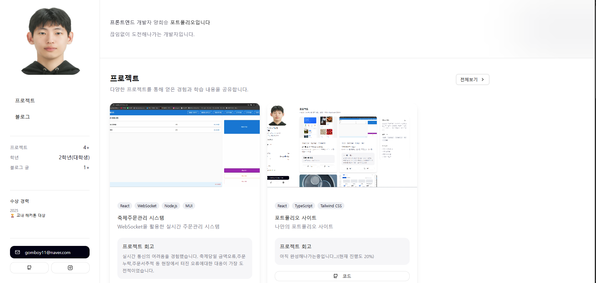
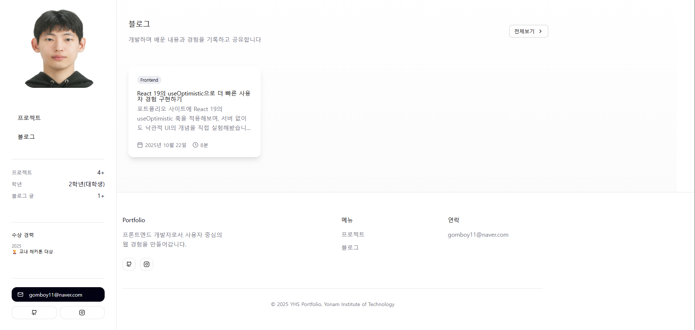
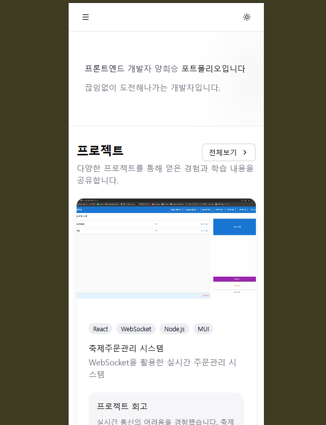
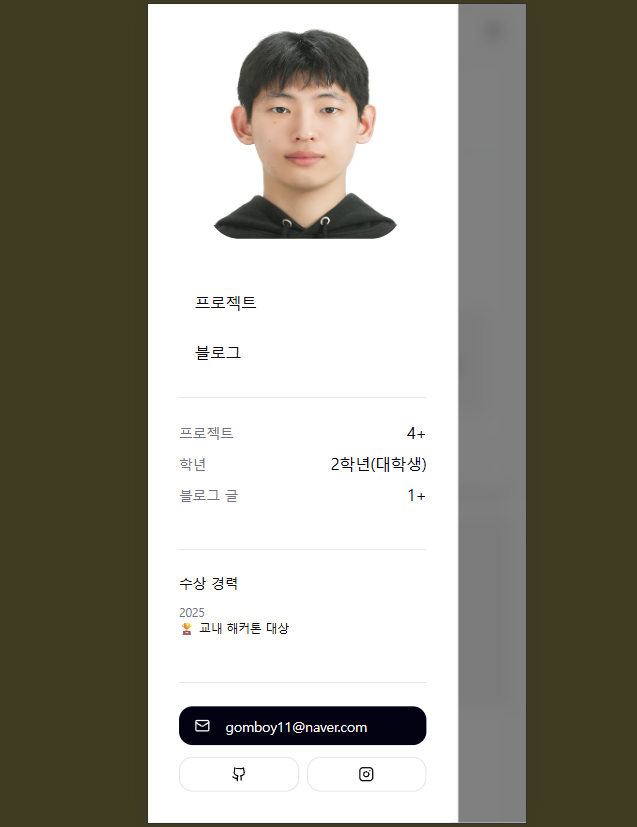

# 🌌 개인 포트폴리오 사이드

> 프론트엔드 개발자로서 도전하며 성장 기록을 남기는 개인 포트폴리오 사이트입니다.  
> 프로젝트, 활동, 기술 스택, 블로그에대한 정보를 한 번에 확인할 수 있도록 구성했습니다.

---

## 🔗 배포 주소

>  **Demo**: https://portfolio-stie.onrender.com/

---

## ✨ 주요 기능 (Features)

- **프로필 소개**
  - 간단한 프로필 정보를 제공합니다.
- **프로젝트 소개**
  - 프로젝트 | 해커톤 | 토이 프로젝트로 분류하여 진행했던 프로젝트 정보를 제공합니다.
  - 사용해본 기술 스택을 태그화 하여 필터링 기능을 제공합니다.
  - 각 프로젝트에대해 배포되어있는 데모 URL을 제공합니다. ( RN 프로젝트 제외 )
- **블로그 소개**
  - 공부 | 프로젝트 | 알고리즘 | 대외활동 으로 분류하여 작성된 포스트 정보를 제공합니다.
  - 샌드박스 기능을 제공하여 작성된 코드를 즉시 실행해보고 체험해볼 수 있습니다.
- **다크/라이트 모드** 
  - 토글로 테마 전환 가능합니다.

---
> 현재 포트폴리오 사이트는 처음부터 갈아엎을예정으로 개발이 잠시 중단되었습니다.
---

## 🧱 기술 스택 (Tech Stack)

- **Front-end**
  - React + TypeScript
  - Vite
  - Tailwind CSS 
- **품질 & 개발 환경**
  - ESLint
  - npm

---

## 화면 구성 (UI Screens)

### 메인 페이지

  
  

> **기능 요약**  
> - SideBar를 통해 간단한 프로필과 수상경력, 연락처 정보를 제공합니다.
> - Pinned 된 프로젝트에대한 정보를 제공합니다.
> - Pinned 된 블로그 포스트에대한 정보를 제공합니다.

---

### 메인 페이지 ( Mobile )

  
  

> **기능 요약**  
> - Sidebar를 좌측 상단 햄버거 시트를 통해 조회할 수 있습니다.
> - 우측 상단 토글버튼을 통해 다크모드를 사용할 수 있습니다.

---

